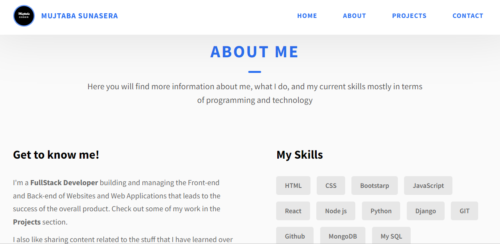

# Portfolio Website

Welcome to my portfolio website! This repository contains the source code for my personal portfolio, showcasing my skills, projects, and achievements as a web developer.

## Features

- **Modern Design:** A clean, user-friendly layout highlighting my web development projects.
- **Responsive:** Works seamlessly on both desktop and mobile devices.
- **Showcase of Skills:** Demonstrates my expertise with HTML, CSS, JavaScript, Node.js, and MongoDB.

## Screenshots




## Installation

To view the website locally, follow these steps:

1. Clone the repository:
   ```bash
   git clone https://github.com/your-username/your-portfolio-repo.git
   ```
2. Navigate to the project directory:
   ```bash
   cd your-portfolio-repo
   ```
3. Install dependencies:
   ```bash
   npm install
   ```
4. Start the development server:
   ```bash
   npm start
   ```

## Usage

- Visit `http://localhost:3000` to view the website in your browser.
- Explore the different sections to learn more about my projects and skills.

## Contributing

Feel free to fork this repository and submit pull requests with improvements or suggestions.

## License

This project is licensed under the MIT License. See the [LICENSE](LICENSE) file for details.

## Contact

For any inquiries or feedback, please reach out to me at [your-email@example.com](mailto:your-email@example.com).
